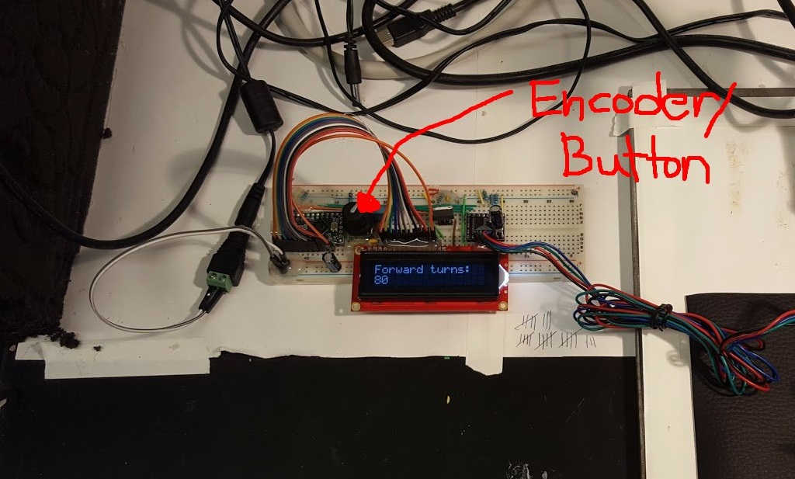

# MWL `twister3`

Code and hardware designs for the MWL `twister3`, a simple and fast stepper-based
trode twister. Its design is inspired by the [SpikeGadgets Tetrode Fabrication Machine](http://www.spikegadgets.com/hardware/tetmachine.html).

## Stuff you need to use `twister3`

### Controller Firmware
`twister3` hardware runs on teensy 3.2. To program the teensy you will need the following dependencies:

- [TeensyStep](https://github.com/luni64/TeensyStep)
- [Liquid Crystal](https://www.arduino.cc/en/Reference/LiquidCrystal)
- [Teensyduino add-on](https://www.pjrc.com/teensy/td_download.html)
- [Arduino IDE](https://www.arduino.cc/en/Main/Software)

### Controller Hardware
This repository should eventually contain circuit board files and BOM. 
Right now, the control hardware is on a breadboard.

### Mechanical parts
This repository should eventually contain cad files and BOM. 

## `twister3` Assembly
This repository should eventually contain and assembly manual.

## `twister3` Usage

### Using the controller
Using the `twister3` controller is simple. Just follow these steps:

- Power the device.
- Place your finger on the control knob. This is the device's only user input
  mechanism.

    - __Pressing it__ will cycle through different settings (forward turns,
      backward turns, turn speed, turning mode)
    - __Turning it__ will increment or decrement the selected setting depending
      on turn direction.
    - __Pressing and holding it__ for 500 msec will execute the twist sequence
      using the current settings
    - __Pressing it__ during a twist will cancel the twist and stop the motor
      immediately.

The motor on `twister3` serves two purposes:

1. Twisting tetrodes (Mode 0)
1. Loading bobbins with tetrode wires (Mode 1)

The mode can be selected using the dial on the `twister3` controller. 
After a mode is selected, all turning parameters pertain to that mode only.
Using `twister3` for each of these purposes is detailed below.

### Loading Bobbins
To load a bobbin, follow these steps:

1. Remove the visor by removing its M6-retention screw
1. Remove one set of bobbins by unscrewing the M3 bold that serves as the axle.
1. Take the bobbins and spacers off the axle.
1. Remove any remaining tetrode wire from bobbin and make sure it is clean of dirt and debris.
1. Remove the twisting attachment from the motor.
1. Place a bobbin on the motor
1. Place the stock spool bearings into the stocks pole and mount on the steel post using the M3 bolt
1. Feed the tetrode wire from the stock spool through the wire guide and wrap once around the bobbin.
1. Set the controller to `mode 1`
1. Select the desired number of turns to load the bobbin. The circumferance of the bobbin is ~10 cm. The amount of wire loaded on the bobbin is therefore the number of turns * 10 cm.
1. Start the turn and wait until it is finished.  __Be very careful not touch moving parts during this process__: the TT wire needs to have constant tension to ensure it is properly loaded on the bobbin.

### Twisting tetrodes
To make a tetrode, follow these steps:
